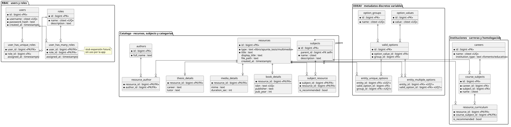

# Bibliotech v4 — Modelo ER (Postgres, solo digital)

> Núcleo 3FN + subtipos CTI + DDEAV acotado. Rol único por user.



## 1. Decisiones

- **Roles:** se conserva `user_has_unique_roles(user_id PK, role_id)` como única tabla canónica.
  `user_has_many_roles(user_id, role_id)` queda como stub de expansión futura, hoy vacía y sin
  dual-write (evita doble fuente de verdad). Cambio de rol = `UPDATE` atómico
  (`fn_assign_unique_role()`). Se descarta la variante M2M `user_role` del UML de consigna por
  redundante: coexistía con la variante única solo con fines didácticos de `UNIQUE`.
- **Recursos:** `resources` es el supertipo digital. Cada tipo nuevo = una hija CTI
  (`book_details`, `thesis_details`, `media_details`). Cero `ALTER` al núcleo.
- **Subjects:** árbol único con `parent_id` autorreferencial. Sirve a ambos dominios
  (taller barrial y materia escolar). `subject_resource.is_recommended` = homologados/recomendados
  por materia (equivalente a `categories`). `careers` + `course_subjects` + `resource_curriculum`
  desdoblan la homologación curricular cuando hace falta distinguir tag temático de materia de plan.
- **DDEAV acotado:** `option_groups / option_values / valid_options / entity_unique_options /
  entity_multiple_options` solo para metadatos discretos variables
  (`NivelLector, Idioma, Formato, Licencia`). Título, ISBN, autor y rutas quedan en columnas.
  Auth nunca va a DDEAV. La FK compuesta `(group_id, valid_option_id) -> valid_options(group_id, id)`
  rechaza valores de grupo incorrecto en el RDBMS.

## 2. Núcleo portable vs adaptadores por dominio

El diagrama se organiza en 4 packages. `RBAC` + `Catálogo` forman el **núcleo portable**:
sirven igual a escuela y a biblioteca barrial sin cambios (identidad, catálogo digital y
taxonomía en árbol). `subjects` vive en Catálogo —no en currícula— porque es la taxonomía
(`categories`) del recurso. La adaptación a cada dominio vive en la periferia: `Instituciones`
(`careers` con `institution_type: fomento|educativa` + homologación curricular), las hijas CTI
(tipo nuevo = tabla hija nueva) y el package `DDEAV` (grupo nuevo = solo DML).

## 3. Fijo vs dinámico

| Va en columnas (3FN) | Va en DDEAV |
|---|---|
| `title, isbn, publisher, authors, file_path, type` | `NivelLector, Idioma, Formato, Licencia, Accesibilidad` |
| `users, roles`, asignaciones | Preferencias e intereses extensibles |
| `subjects`, homologaciones | Nuevos grupos discretos futuros (solo DML) |

## 4. Archivos

- [`01-schema.sql`](../01-schema.sql) — DDL.
- [`02-seed.sql`](../02-seed.sql) — datos mínimos (3 users, 1 libro, 1 apunte, árbol, homologación).
- [`03-views-functions.sql`](../03-views-functions.sql) — `v_book`, `v_resource_by_subject`,
  `v_resource_options`, `fn_assign_unique_role()`, `fn_add_book()`.
- [`diagrams/bibliotech.puml`](diagrams/bibliotech.puml) — fuente editable del diagrama.

## 5. Consultas clave

```sql
-- Recomendados de una materia
SELECT * FROM v_resource_by_subject WHERE subject = 'Algebra' AND is_recommended;

-- Rol actual de un user
SELECT u.username, r.name FROM user_has_unique_roles ur
JOIN users u ON u.id = ur.user_id JOIN roles r ON r.id = ur.role_id;

-- Opciones DDEAV de un recurso
SELECT * FROM v_resource_options WHERE title = 'Algebra Elemental';
```
