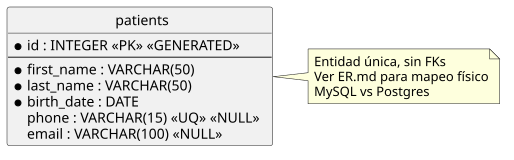

# patientsdb — Modelo ER (lógico, engine-agnostic)

> Tabla única `patients`, sin FKs. Diagrama lógico ANSI; el mapeo físico vive en §3.

## 1. Alcance

- DB `patientsdb`, 1 entidad `patients`, 0 relaciones.
- Fuente: `GUIA-TIB-02-PARTE-02-ISFT` (Ej. 1–6: DDL, DML, DQL con `TIMESTAMPDIFF` / edad).
- Este diagrama no inventa dominio: documenta lo que la consigna pide.

## 2. Decisiones lógicas

- `id INTEGER PK GENERATED`: identidad sintética, única vía de acceso para `UPDATE`/`DELETE` (Ej. 5–6).
- `first_name`, `last_name`, `birth_date` mandatorios (`*`): la edad se deriva de `birth_date`, nunca se almacena.
- `phone UQ NULL`: unicidad solo cuando hay valor; múltiples `NULL` permitidos (semántica estándar).
- `email NULL` sin `UQ`: la consigna no lo exige; no se asume constraint de más.
- Edad = atributo derivado (`TIMESTAMPDIFF(YEAR, birth_date, CURDATE())` en MySQL / `EXTRACT(YEAR FROM AGE(...))` en Postgres). No va al ER.

## 3. Mapeo físico

| Lógico | MySQL (consigna) | Postgres (uso real) |
|---|---|---|
| DB `patientsdb` | `CHARSET utf8mb4 COLLATE utf8mb4_unicode_ci` | `ENCODING 'UTF8'` (default) |
| `id INTEGER PK GENERATED` | `INT AUTO_INCREMENT PRIMARY KEY` | `INTEGER GENERATED ALWAYS AS IDENTITY PRIMARY KEY` |
| `first_name VARCHAR(50) NOT NULL` | `VARCHAR(50) NOT NULL` | `VARCHAR(50) NOT NULL` |
| `last_name VARCHAR(50) NOT NULL` | `VARCHAR(50) NOT NULL` | `VARCHAR(50) NOT NULL` |
| `birth_date DATE NOT NULL` | `DATE NOT NULL` (`'YYYY-MM-DD'`) | `DATE NOT NULL` (`'YYYY-MM-DD'`) |
| `phone VARCHAR(15) UQ NULL` | `VARCHAR(15) UNIQUE NULL` | `VARCHAR(15) UNIQUE NULL` |
| `email VARCHAR(100) NULL` | `VARCHAR(100) NULL` | `VARCHAR(100) NULL` |

## 4. Archivos

- [`diagrams/patientsdb.puml`](diagrams/patientsdb.puml) — fuente editable del diagrama.
- [`diagrams/patientsdb.svg`](diagrams/patientsdb.svg) — renderizado (`plantuml -tsvg docs/diagrams/*.puml`).
- [`GLOSSARY.md`](GLOSSARY.md) — glosario PostgreSQL con equivalencias MySQL (solo términos usados en `db/`).

## 5. Trazabilidad (consigna → script en `db/`)

| Consigna | Script |
|---|---|
| Ej.1 (DCL: DB + usuario) | [`db/01-setup.sql`](../db/01-setup.sql) |
| Ej.2 (DDL: tabla patients) | [`db/02-schema.sql`](../db/02-schema.sql) |
| Ej.3 (DML: INSERT 3 filas) | [`db/03-seed.sql`](../db/03-seed.sql) |
| Ej.4 (DQL: 4 SELECT) | [`db/04-queries.sql`](../db/04-queries.sql) |
| Ej.5 (DML: UPDATE John) | [`db/05-update.sql`](../db/05-update.sql) |
| Ej.6 (DML: DELETE Mike) | [`db/06-delete.sql`](../db/06-delete.sql) |
| Verificación (estado final) | [`db/99-verify.sql`](../db/99-verify.sql) |
