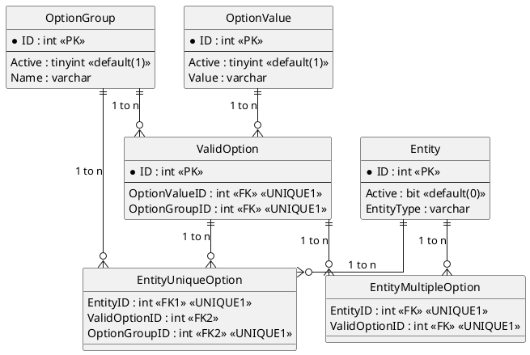
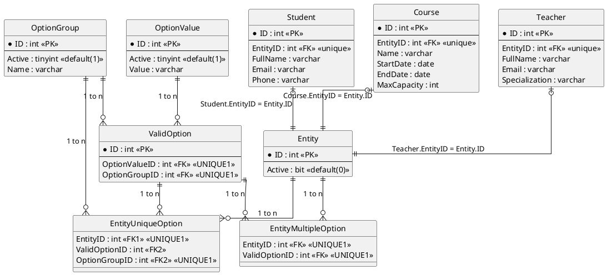

# ISFT 151 - Base de Datos: Laboratorio 04 - Modelo Relacional Adaptativo

## Descripción

Implementación del patrón **Dictionary-Driven Entity-Attribute-Value (DDEAV)**
combinado con **Class-Table Inheritance (CTI)** (Fowler, *Patterns of Enterprise
Application Architecture*) y soft-delete lógico, aplicado al dominio educativo.

El modelo permite que los atributos de entidades como `Course`, `Student` y
`Teacher` evolucionen ante cambios regulatorios (ej: nuevas modalidades de
cursada, programas de becas, ajustes curriculares) **sin necesidad de ALTER
TABLE** — todo se resuelve insertando datos en catálogos (`OptionGroup`,
`OptionValue`) y asignándolos mediante tablas puente (`EntityUniqueOption`,
`EntityMultipleOption`).

La ejecución se gestiona a través de una arquitectura basada en contenedores
(Docker) y orquestada con GNU Make para garantizar un entorno reproducible y
aislado.

### Modelo Dictionary-Driven EAV (DDEAV)



### DDEAV + Class-Table Inheritance (CTI)



## Requisitos Previos

* [Docker Engine](https://docs.docker.com/engine/install/)
* [Docker Compose](https://docs.docker.com/compose/install/)
* GNU Make

## Estructura del Proyecto

```text
.
├── docker-compose.yaml     # Servicio MySQL 8.0
├── Makefile                # Orquestador de scripts
└── sql/
    ├── 01_setup.sql        # DCL: Creación de DB (academic_ddeav_db) y usuario
    ├── 02_schema.sql       # DDL: CTI (Entity, Student, Course, Teacher) + DDEAV
    ├── 03_seed.sql         # DML: Población inicial (escenario 2009)
    ├── 04_alta_opcion.sql  # DML: Prototipo — alta de nueva opción (Consigna 2)
    └── 05_queries.sql      # DQL: Consultas de demostración
```

## Flujo de Ejecución

### 1. Inicializar la infraestructura

```bash
docker compose up -d
```

*Nota: Aguardar aproximadamente 10-15 segundos hasta que el estado del
contenedor figure como `healthy` antes de proceder.*

### 2. Ejecución secuencial

* **Setup** — Creación de la base de datos y credenciales:

  ```bash
  make setup
  ```

* **Schema** — Tablas CTI (Entity, Student, Course, Teacher) + DDEAV
  (OptionGroup, OptionValue, ValidOption, EntityUniqueOption,
  EntityMultipleOption):

  ```bash
  make schema
  ```

* **Seed** — Población inicial: entidades educativas y catálogo con modalidad
  "Presencialidad Plena":

  ```bash
  make seed
  ```

* **Alta de opción (prototipo)** — Registro de "Propuesta Pedagógica Combinada"
  y asignación a un curso existente:

  ```bash
  make alta
  ```

* **Consultas** — Demostración de recuperación de datos desde el modelo DDEAV:

  ```bash
  make queries
  ```

*Alternativa:* Ejecutar la suite completa de forma secuencial:

```bash
make all
```

## Limpieza del Entorno

Una vez finalizada la tarea y capturadas las evidencias correspondientes:

```bash
docker compose down -v
```

## Referencias

- **Fowler, M. (2003)**. *Patterns of Enterprise Application Architecture*.
  Addison-Wesley. — Patrón Class-Table Inheritance (CTI).
- **Entity–Attribute–Value model** — Wikipedia.
  [enlace](https://en.wikipedia.org/wiki/Entity%E2%80%93attribute%E2%80%93value_model)
