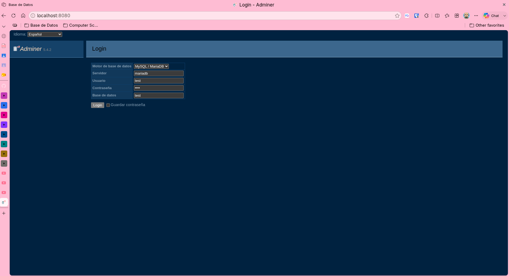
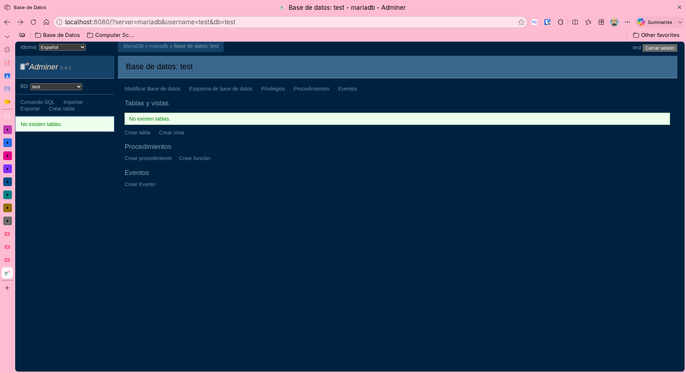
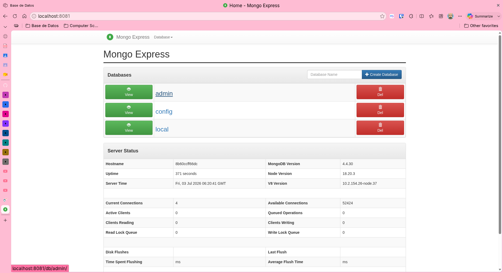

# Laboratorio Extra — Bases de Datos

> Construyan el archivo `docker-compose.yml` para montar un servidor de MongoDB.
> Investiguen si pueden usar un cliente gráfico con esta base de datos NoSQL.

---

## Stack SQL — MariaDB + Adminer

**Demostración en terminal:** 

| Captura | Descripción |
|---|---|
|  | Pantalla de login de Adminer |
|  | Dashboard autenticado — base `test` |

```bash
cd sql
docker compose up -d
docker compose ps
curl http://localhost:8080
```

---

## Stack NoSQL — MongoDB + Mongo Express

**Demostración en terminal:** 

| Captura | Descripción |
|---|---|
|  | Mongo Express — bases `admin`, `config`, `local` |

```bash
cd nosql
docker compose up -d
docker compose ps
curl http://localhost:8081
```

---

**Credenciales compartidas:** usuario `test`, contraseña `test`, base de datos `test`.
