# 2026-07-02 - Laboratorio - Tecnologias que usan Relational Databases (RDBs)

- **WordPress** utiliza por defecto MySQL para almacenar todo el contenido, la configuración y los datos del sitio. También es compatible de forma nativa y funciona como reemplazo directo con MariaDB.
- **Joomla** utiliza por defecto el sistema de gestión de bases de datos relacionales MySQL (a través de la extensión MySQLi).
- **Drupal** utiliza MySQL
- **Odoo** utiliza PostgreSQL

## Actividad

> En Docker van a **implementar al menos un CMS y ODOO** (Modo prueba y desarrollo - Aprendizaje) porque son contenedores para implementación en producción para una empresa deberían usar máquinas virtuales KVM.

---

## Stack CMS — WordPress + MySQL

**Despliegue (local) y comprobación**

```bash
cd wordpress
docker compose up -d
docker compose ps
curl http://localhost:8080
```

**Demostración en terminal:** 

**Primer login y config**

| Captura                                                            | Descripción             |
| ------------------------------------------------------------------ | ----------------------- |
| 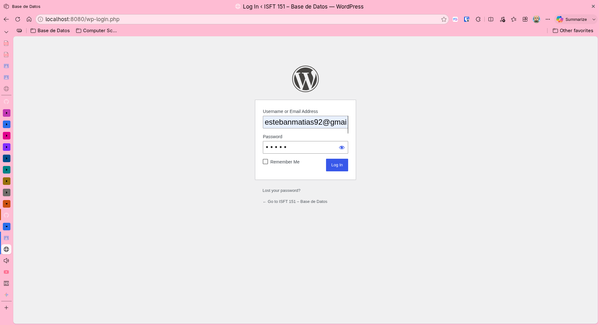 | Registro Admin          |
| 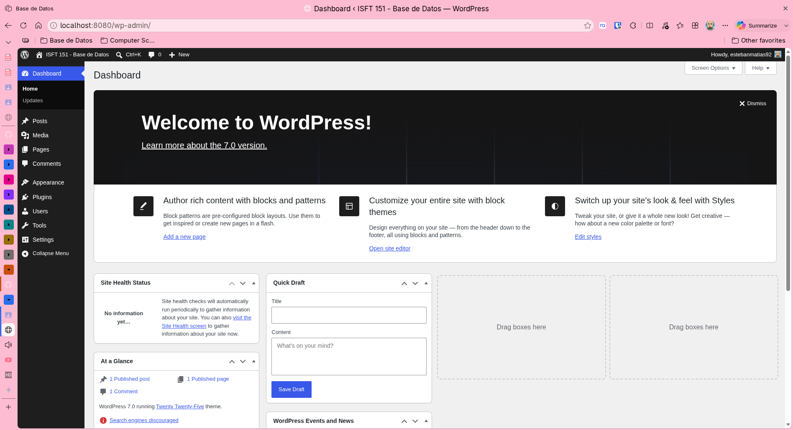 | Panel de Administración |
| 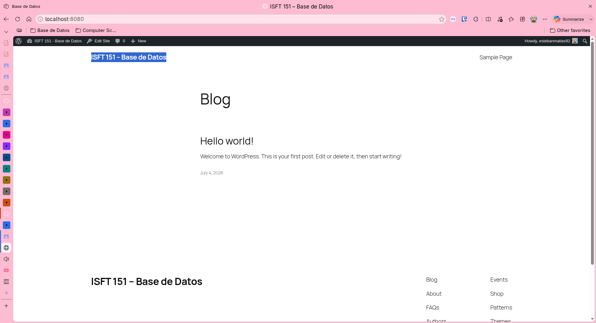 | Página Web              |
| 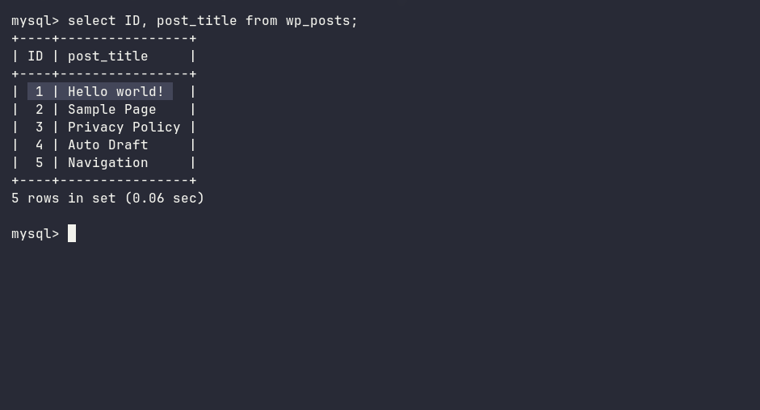 | Shell - DB Query        |

---

## Stack ERP — Odoo + PostgreSQL

**Despliegue (local) y comprobación**

```bash
cd odoo
docker compose up -d
docker compose ps
curl http://localhost:8069
```

**Demostración en terminal:** 

**Primer login y config**

| Captura                                                       | Descripción                                 |
| ------------------------------------------------------------- | ------------------------------------------- |
| 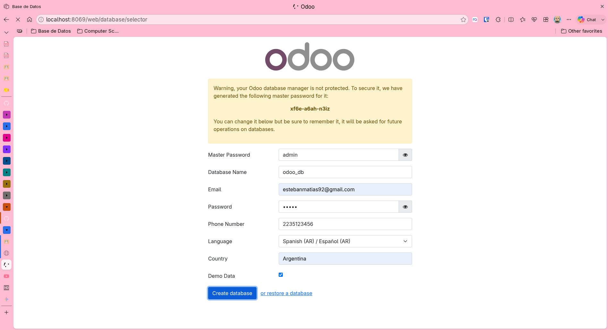 | Registro Admin                              |
| 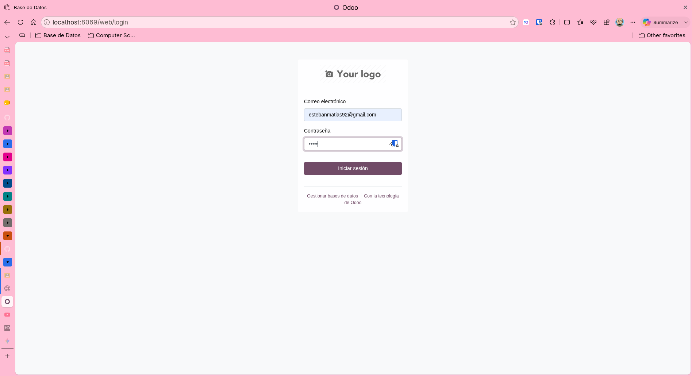 | Login Admin                                 |
| 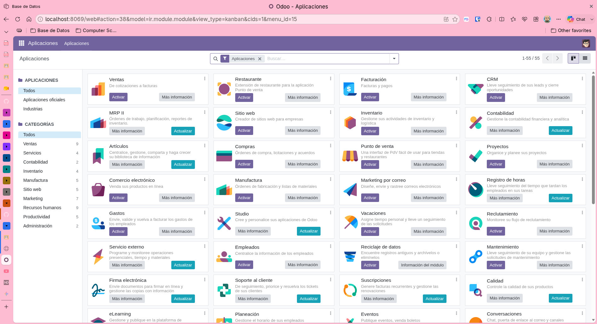 | Panel de Administración                     |
| 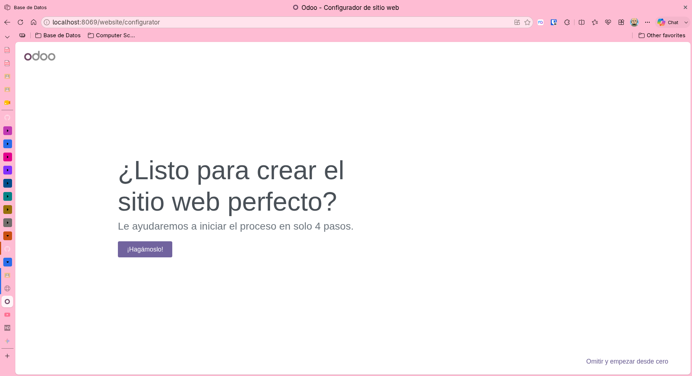 | Activación - Addon Web Page                 |
| 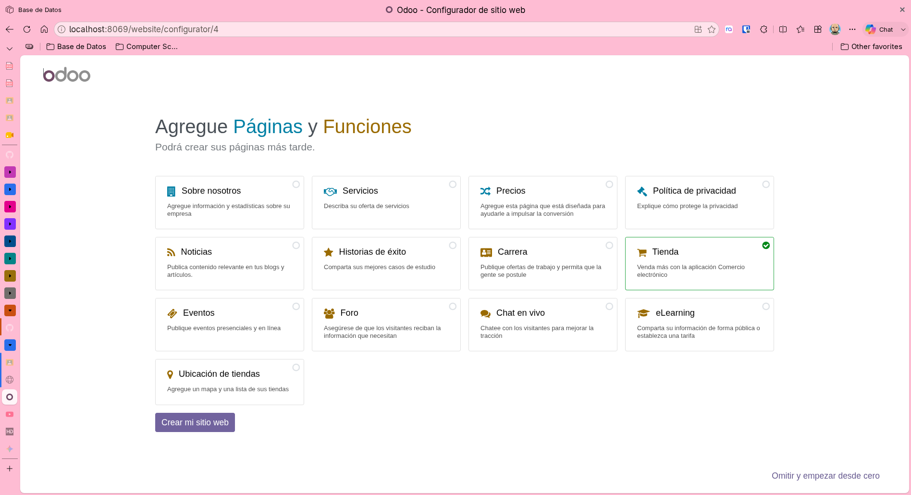 | Configuracion Guiada - Web Page + Ecommerce |
| 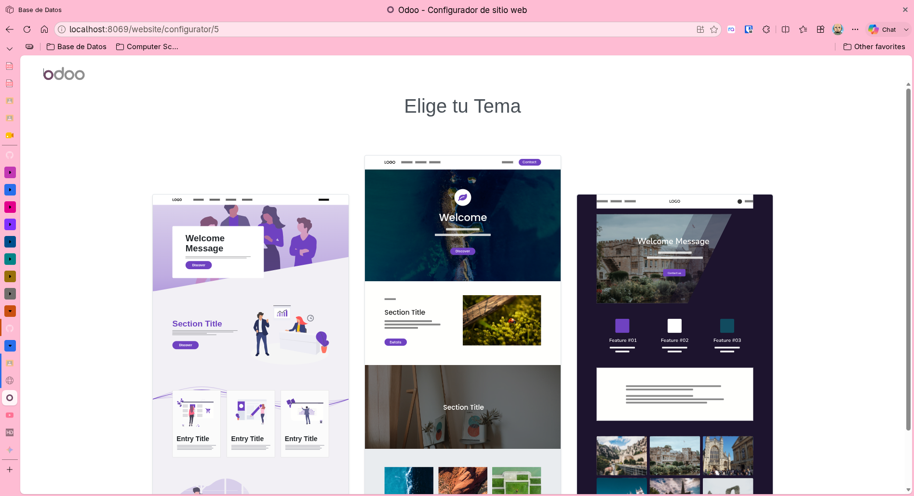 | Configuracion Guiada - Web Page Theme       |
|  | Web Page - Home                             |
| 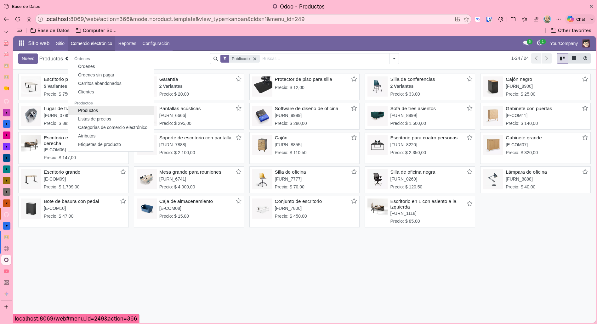 | Ecommerce - Admin - Products                |
| 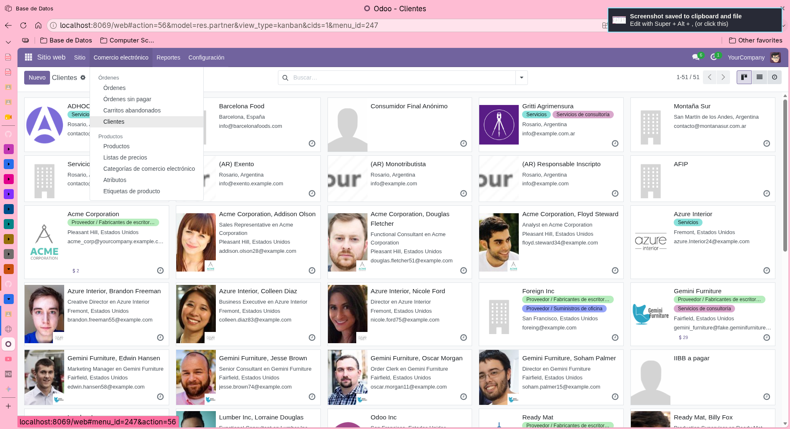 | Ecommerce - Admin - Clients                 |
| 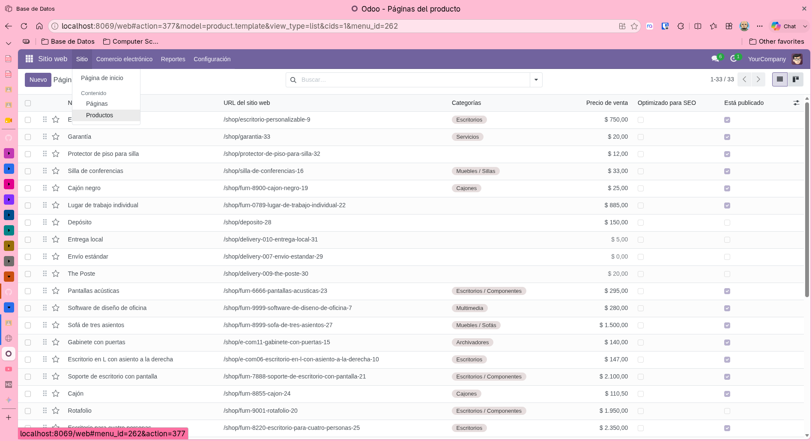 | Web Page - Admin - Products                 |
| 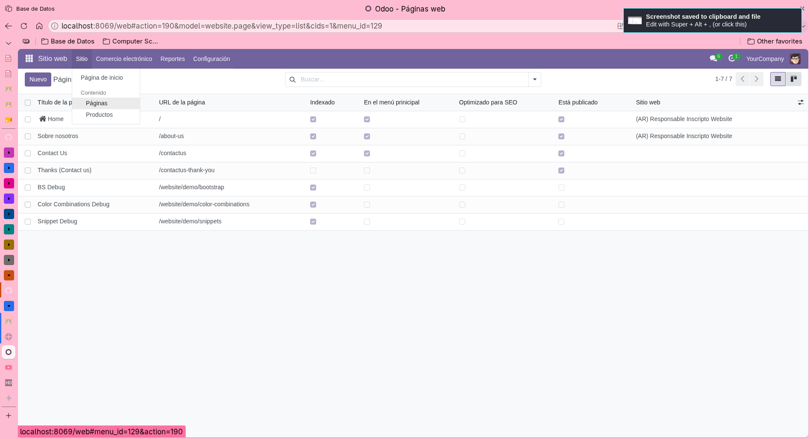 | Web Page - Admin - Clients                  |
| 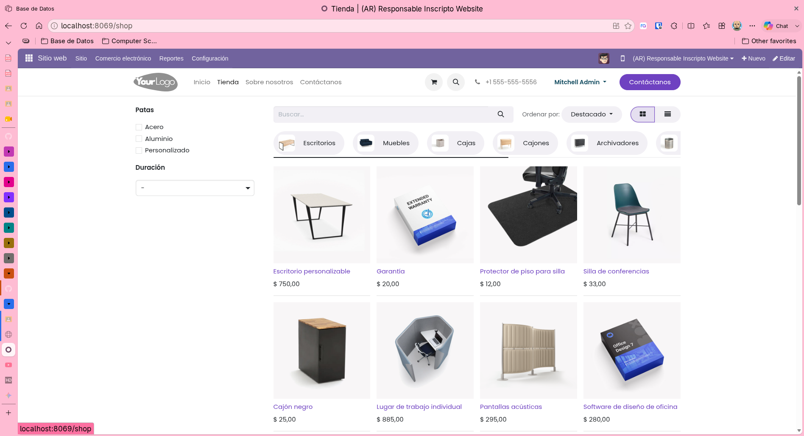 | Web Page - Tienda Ecommerce                 |

---

## Marco Teórico - Virtualización KVM y Contenedores

Las máquinas virtuales (como las creadas con KVM) virtualizan el hardware, ejecutando un sistema operativo completo y un hipervisor. Los contenedores virtualizan solo el sistema operativo, compartiendo el núcleo () del host. Esto hace a los contenedores mucho más ligeros, rápidos de iniciar y eficientes en recursos.

### 1. Arquitectura y Rendimiento

**KVM** (Kernel-based Virtual Machine): Funciona como un hipervisor de tipo 1 integrado directamente en el kernel de Linux. Cada máquina virtual incluye su propio Sistema Operativo Huésped (), lo que consume una gran cantidad de memoria RAM y almacenamiento.

**Contenedores**: Utilizan un motor (como Docker o Kubernetes) que se ejecuta directamente sobre el sistema operativo principal. Los contenedores solo empaquetan la aplicación y sus dependencias. Son altamente eficientes, permitiendo ejecutar muchas más instancias en el mismo hardware que una máquina virtual.

### 2. Aislamiento y Seguridad

**KVM**: Ofrece un aislamiento total a nivel de hardware. Si una máquina virtual es vulnerada, es muy difícil que el problema afecte al sistema principal u a otras máquinas virtuales.

**Contenedores**: El aislamiento es a nivel de procesos. Como todos los contenedores comparten el mismo kernel del sistema operativo host, existe un riesgo de seguridad mayor si el propio kernel es atacado.

### 3. Velocidad y Portabilidad

**KVM**: El arranque puede tomar varios minutos o decenas de segundos, ya que necesita iniciar un sistema operativo completo desde cero.

**Contenedores**: Se inician en fracciones de segundo y pueden detenerse o escalarse instantáneamente. Son extremadamente portátiles, garantizando que una aplicación funcionará igual en el entorno de desarrollo, pruebas o producción.

### Recomendaciones

- **Para virtualizar contenedores en modo desarrollador**, recomendamos: <https://www.docker.com/>
- **Para virtualizar en modo producción con KVM, recomendamos**: <https://www.proxmox.com/en/>

> Álvaro recomienda a Jonatan Castro: <https://www.youtube.com/@JonatanCastro>
